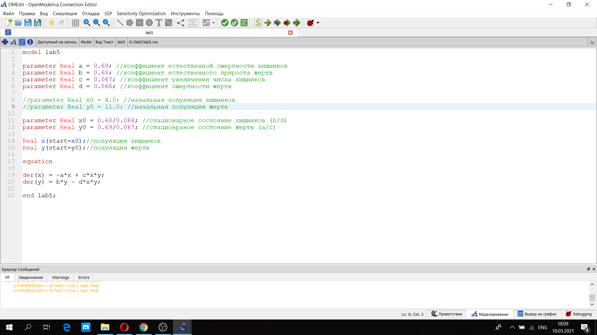
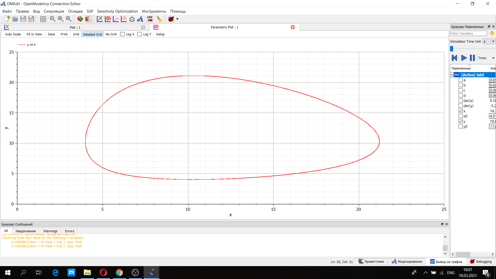
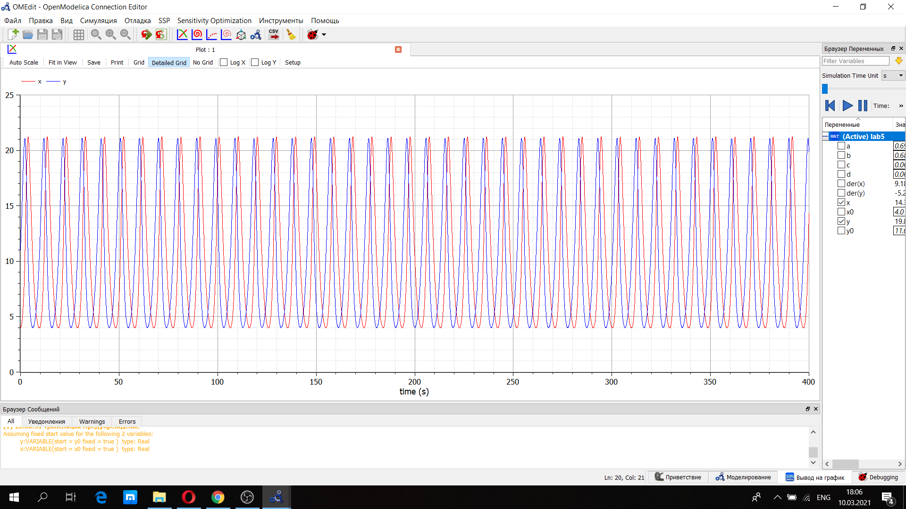
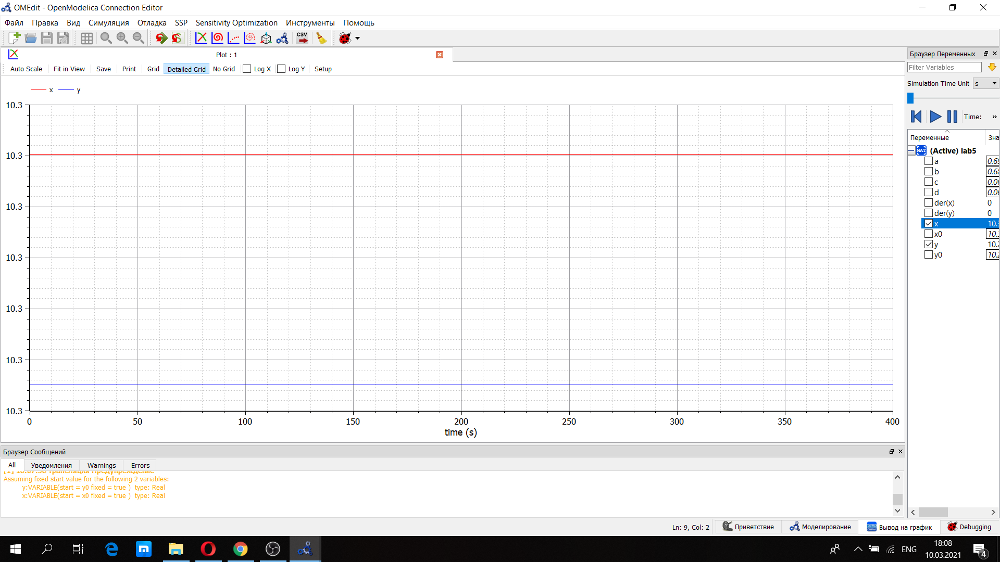

---
# Front matter
lang: ru-RU
title: "Лабораторная работа №5"
author: "Селезнев Василий Александрович"

# Formatting
toc-title: "Содержание"
toc: true # Table of contents
toc_depth: 2
lof: true # List of figures
lot: true # List of tables
fontsize: 12pt
linestretch: 1.5
papersize: a4paper
documentclass: scrreprt
polyglossia-lang: russian
polyglossia-otherlangs: english
mainfont: PT Serif
romanfont: PT Serif
sansfont: PT Sans
monofont: PT Mono
mainfontoptions: Ligatures=TeX
romanfontoptions: Ligatures=TeX
sansfontoptions: Ligatures=TeX,Scale=MatchLowercase
monofontoptions: Scale=MatchLowercase
indent: true
pdf-engine: lualatex
header-includes:
  - \linepenalty=10 # the penalty added to the badness of each line within a paragraph (no associated penalty node) Increasing the value makes tex try to have fewer lines in the paragraph.
  - \interlinepenalty=0 # value of the penalty (node) added after each line of a paragraph.
  - \hyphenpenalty=50 # the penalty for line breaking at an automatically inserted hyphen
  - \exhyphenpenalty=50 # the penalty for line breaking at an explicit hyphen
  - \binoppenalty=700 # the penalty for breaking a line at a binary operator
  - \relpenalty=500 # the penalty for breaking a line at a relation
  - \clubpenalty=150 # extra penalty for breaking after first line of a paragraph
  - \widowpenalty=150 # extra penalty for breaking before last line of a paragraph
  - \displaywidowpenalty=50 # extra penalty for breaking before last line before a display math
  - \brokenpenalty=100 # extra penalty for page breaking after a hyphenated line
  - \predisplaypenalty=10000 # penalty for breaking before a display
  - \postdisplaypenalty=0 # penalty for breaking after a display
  - \floatingpenalty = 20000 # penalty for splitting an insertion (can only be split footnote in standard LaTeX)
  - \raggedbottom # or \flushbottom
  - \usepackage{float} # keep figures where there are in the text
  - \floatplacement{figure}{H} # keep figures where there are in the text
---

# Цель работы

Познакомиться с моделью Лотки-Вольтерры, используя язык программирования Modelica.

# Задание

1. Построить график зависимости x от y и графики функций X(t), y(t)
2. Найти стационарное состояние системы 

# Выполнение лабораторной работы

Рассмотрим простейшую модель взаимодействия двух видов типа "хищник-жертва". 
  
Уравнение модели "хищник-жертва" имеет следующий вид:
	$$ \begin{cases} 
		\frac{dx}{dt} = -0.69x(t)+0.068x(t)y(t)
		\\ 
		\frac{dy}{dt} = 0.67y(t)-0.066x(t)y(t) 
		\end{cases} 
	$$ 
Начальные условия: x_0 = 4 и y_0 = 11.

Ниже представлен скриншот кода программы, написанный на языке программирования Modelica. (рис 1. -@fig:001)  

{ #fig:001 width=70% }  

Представлен график зависимости численности популяции хищников от численности популяции жертв. (рис 2. -@fig:001)  

{ #fig:001 width=70% }  

Ниже представлен график изменения численности популяции хищников и численности популяции жертв с течением времени. (рис 3. -@fig:001)  

{ #fig:001 width=70% }    

Также представлено стационарноее состояние системы. При нем значения числа жертв и хищников не меняется во времени (рис 4. -@fig:001)  

{ #fig:001 width=70% }   

# Выводы

Я ознакомился с простейшей моделью взаимодействия двух видов типа "хищник-жертва" и построил для нее графики; нашел стационарное распределение, используя язык программирования Modelica.
